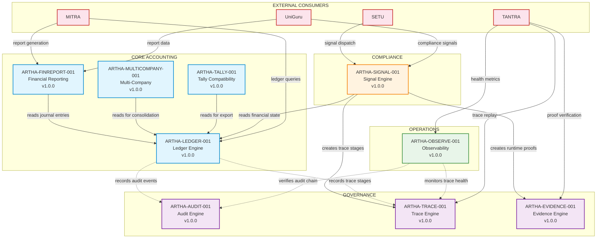
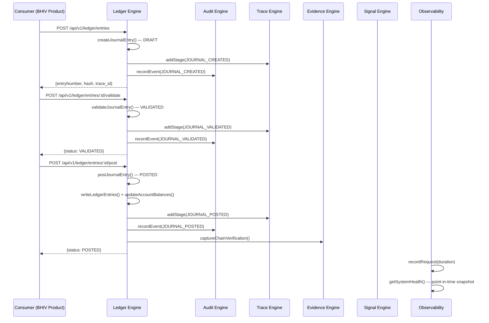
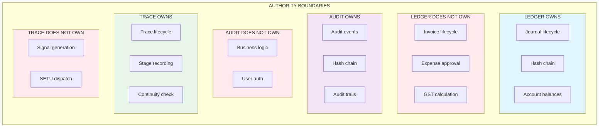
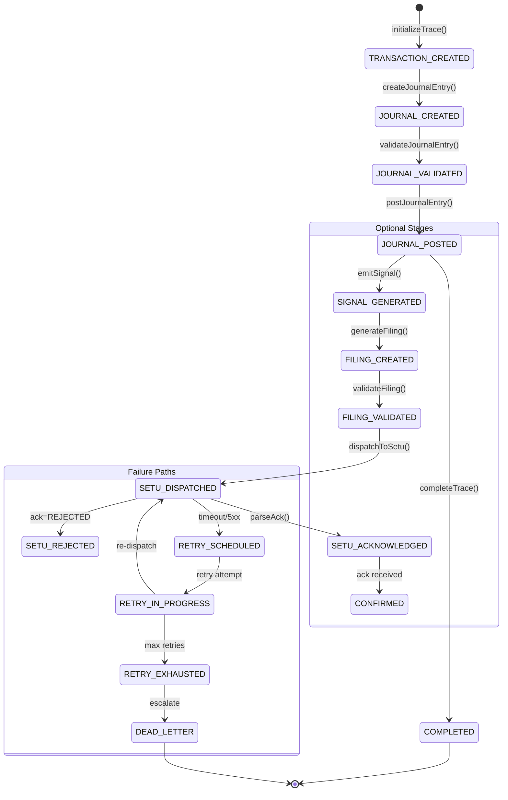

# ARTHA Ecosystem Architecture Diagrams

## 1. Capability Dependency Graph



## 2. Data Flow — End-to-End Transaction Lifecycle



## 3. Authority Boundary Enforcement



## 4. Trace Continuity Flow



## 5. SETU Pipeline Architecture

```mermaid
graph LR
    subgraph PIPELINE["SETU PIPELINE (Pure Functions)"]
        direction LR
        
        S1["1. NORMALIZE<br/>normalizeSignal()<br/>Harmonizes input shapes"]
        S2["2. VALIDATE<br/>validateSignal()<br/>26 types, 6 modules, 5 entities"]
        S3["3. MAP<br/>mapToSetuPayload()<br/>Canonical contract shape"]
        S4["4. SERIALIZE<br/>serializeForSetu()<br/>Idempotency key, content hash"]
        
        S1 --> S2 --> S3 --> S4
    end
    
    subgraph DISPATCH["DISPATCH LAYER"]
        D1["SetuDispatch Record"]
        D2["HTTP POST to SETU"]
        D3["Parse Acknowledgement"]
        D4["RuntimeProof Capture"]
        
        D1 --> D2 --> D3 --> D4
    end
    
    subgraph RETRY["RETRY MECHANISM"]
        R1{"Retryable?"}
        R2["Exponential Backoff<br/>2^attempt × 60s"]
        R3["Dead Letter Queue"]
        
        R1 -->|Yes: 5xx, timeout, 429| R2
        R1 -->|No: 4xx (not 429)| R3
        R2 -->|Max 3 retries| R3
    end
    
    S4 --> D1
    D4 --> R1
    
    style S1 fill:#e3f2fd
    style S2 fill:#e3f2fd
    style S3 fill:#e3f2fd
    style S4 fill:#e3f2fd
```

## 6. Capability Consumer Map

```mermaid
graph TB
    subgraph ARTHA["ARTHA CAPABILITY PROVIDER"]
        C1["LEDGER-001"]
        C2["AUDIT-001"]
        C3["TRACE-001"]
        C4["EVIDENCE-001"]
        C5["OBSERVE-001"]
        C6["FINREPORT-001"]
        C7["SIGNAL-001"]
        C8["MULTICOMPANY-001"]
        C9["TALLY-001"]
    end
    
    subgraph SETU_C["SETU"]
        S1["Signal Ingestion"]
        S2["Dispatch Tracking"]
    end
    
    subgraph TANTRA_C["TANTRA"]
        T1["Trace Replay"]
        T2["Proof Verification"]
        T3["Heartbeat"]
    end
    
    subgraph MITRA_C["MITRA (Future)"]
        M1["Ledger Queries"]
        M2["Report Generation"]
    end
    
    subgraph UNIGURU_C["UniGuru (Future)"]
        U1["Report Data"]
        U2["Compliance Signals"]
    end
    
    subgraph K8S["KUBERNETES"]
        K1["Liveness Probe"]
        K2["Readiness Probe"]
    end
    
    subgraph MONITORING["PROMETHEUS/GRAFANA"]
        P1["Metrics Scraping"]
        P2["Dashboard"]
    end
    
    C7 --> S1
    C3 --> S2
    C3 --> T1
    C4 --> T2
    C5 --> T3
    C5 --> K1
    C5 --> K2
    C5 --> P1
    C5 --> P2
    C1 --> M1
    C6 --> M2
    C6 --> U1
    C7 --> U2
    
    style ARTHA fill:#e8eaf6
    style SETU_C fill:#fff3e0
    style TANTRA_C fill:#fce4ec
    style MITRA_C fill:#e0f7fa
    style UNIGURU_C fill:#f1f8e9
    style K8S fill:#fff8e1
    style MONITORING fill:#ede7f6
```


